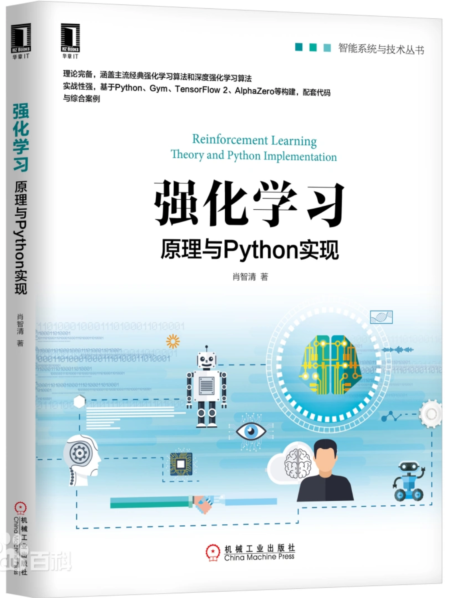

# 强化学习：原理与Python实现

## Cover

---

# Content:

## 第1章 初识强化学习

### 1.1 强化学习及其关键元素

### 1.2 强化学习的应用

### 1.3 智能体/环境接口

### 1.4 强化学习的分类

#### 1.4.1 按任务分类

#### 1.4.2 按算法分类

### 1.5 如何学习强化学习

#### 1.5.1 学习路线

#### 1.5.2 学习资源

### 1.6 案例：基于Gym库的智能体/环境交互

#### 1.6.1 安装Gym库

#### 1.6.2 使用Gym库

#### 1.6.3 小车上山

### 1.7 本章小结

## 第2章 Markov 决策过程

### 2.1 Markov决策过程模型

#### 2.1.1 离散时间Markov决策过程

#### 2.1.2 环境与动力

#### 2.1.3 智能体与策略

#### 2.1.4 奖励 回报与价值函数

### 2.2 Bellman期望方程

### 2.3 最优策略及其性质

#### 2.3.1 最优策略与最优价值函数

#### 2.3.2 Bellman最优方程

#### 2.3.3 用Bellman最优方程求解最优策略

### 2.4 案例：悬崖寻路

#### 2.4.1 实验环境使用

#### 2.4.2 求解Bellman期望方程

#### 2.4.3 求解Bellman最优方程

### 2.5 本章小结

## 第3章 有模型数值迭代

### 3.1 度量空间与压缩映射

#### 3.1.1 度量空间及其完备性

#### 3.1.2 压缩映射与Bellman算子

#### 3.1.3 Banach不动点定理

### 3.2 有模型策略迭代

#### 3.2.1 策略评估

#### 3.2.2 策略改进

#### 3.2.3 策略迭代

### 3.3 有模型价值迭代

### 3.4 动态规划

#### 3.4.1 从动态规划看迭代算法

#### 3.4.2 异步动态规划

### 3.5 案例：冰面滑行

#### 3.5.1 实验环境使用

#### 3.5.2 有模型策略迭代求解

#### 3.5.3 有模型价值迭代求解

### 3.6 本章小结

## 第4章 回合更新价值迭代

### 4.1 同策回合更新

#### 4.1.1 同策回合更新策略评估

#### 4.1.2 带起始探索的同策回合更新

#### 4.1.3 基于柔性策略的同策回合更新

### 4.2 异策回合更新

#### 4.2.1 重要性采样

#### 4.2.2 异策回合更新策略评估

#### 4.2.3 异策回合更新最优策略求解

### 4.3 案例：21点游戏

#### 4.3.1 实验环境使用

#### 4.3.2 同策策略评估

#### 4.3.3 同策最优策略求解

#### 4.3.4 异策策略评估

#### 4.3.5 异策最优策略求解

### 4.4 本章小结

## 第5章 时序差分价值迭代

### 5.1 同策时序差分更新

#### 5.1.1 时序差分更新策略评估

#### 5.1.2 SARSA算法

#### 5.1.3 期望SARSA算法

### 5.2 异策时序差分更新

#### 5.2.1 基于重要性采样的异策算法

#### 5.2.2 Q学习

#### 5.2.3 双重Q学习

### 5.3 资格迹

#### 5.3.1 λ回报

#### 5.3.2 TD(λ)

### 5.4 案例：出租车调度

#### 5.4.1 实验环境使用

#### 5.4.2 同策时序差分学习调度

#### 5.4.3 异策时序差分学习调度

#### 5.4.4 资格迹学习调度

### 5.5 本章小结

## 第6章 函数近似方法

### 6.1 函数近似原理

#### 6.1.1 随机梯度下降

#### 6.1.2 半梯度下降

#### 6.1.3 带资格迹的半梯度下降

### 6.2 线性近似

#### 6.2.1 精确查找表与线性近似的关系

#### 6.2.2 线性最小二乘策略评估

#### 6.2.3 线性最小二乘最优策略求解

### 6.3 函数近似的收敛性

### 6.4 深度Q学习

#### 6.4.1 经验回放

#### 6.4.2 带目标网络的深度Q学习

#### 6.4.3 双重深度Q网络

#### 6.4.4 对偶深度Q网络

### 6.5 案例：小车上山

#### 6.5.1 实验环境使用

#### 6.5.2 用线性近似求解最优策略

#### 6.5.3 用深度Q学习求解最优策略

### 6.6 本章小结

## 第7章 回合更新策略梯度方法

### 7.1 策略梯度算法的原理

#### 7.1.1 函数近似与动作偏好

#### 7.1.2 策略梯度定理

### 7.2 同策回合更新策略梯度算法

#### 7.2.1 简单的策略梯度算法

#### 7.2.2 带基线的简单策略梯度算法

### 7.3 异策回合更新策略梯度算法

### 7.4 策略梯度更新和极大似然估计的关系

### 7.5 案例：车杆平衡

#### 7.5.1 同策策略梯度算法求解最优策略

#### 7.5.2 异策策略梯度算法求解最优策略

### 7.6 本章小结

## 第8章 执行者/评论者方法

### 8.1 同策执行者/评论者算法

#### 8.1.1 动作价值执行者/评论者算法

#### 8.1.2 优势执行者/评论者算法

#### 8.1.3 带资格迹的执行者/评论者算法

### 8.2 基于代理优势的同策算法

#### 8.2.1 代理优势

#### 8.2.2 邻近策略优化

### 8.3 信任域算法

#### 8.3.1 KL散度

#### 8.3.2 信任域

#### 8.3.3 自然策略梯度算法

#### 8.3.4 信任域策略优化

#### 8.3.5 Kronecker因子信任域执行者/评论者算法

### 8.4 重要性采样异策执行者/评论者算法

#### 8.4.1 基本的异策算法

#### 8.4.2 带经验回放的异策算法

### 8.5 柔性执行者/评论者算法

#### 8.5.1 熵

#### 8.5.2 奖励工程和带熵的奖励

#### 8.5.3 柔性执行者/评论者的网络设计

### 8.6 案例：双节倒立摆

#### 8.6.1 同策执行者/评论者算法求解最优策略

#### 8.6.2 异策执行者/评论者算法求解最优策略

### 8.7 本章小结

## 第9章 连续动作空间的确定性策略

### 9.1 同策确定性算法

#### 9.1.1 策略梯度定理的确定性版本

#### 9.1.2 基本的同策确定性执行者/评论者算法

### 9.2 异策确定性算法

#### 9.2.1 基本的异策确定性执行者/评论者算法

#### 9.2.2 深度确定性策略梯度算法

#### 9.2.3 双重延迟深度确定性策略梯度算法

### 9.3 案例：倒立摆的控制

#### 9.3.1 用深度确定性策略梯度算法求解

#### 9.3.2 用双重延迟深度确定性算法求解

### 9.4 本章小结

## 第10章 综合案例：电动游戏

### 10.1 Atari游戏环境

#### 10.1.1 Gym库的完整安装

#### 10.1.2 游戏环境使用

### 10.2 基于深度Q学习的游戏AI

#### 10.2.1 算法设计

#### 10.2.2 智能体的实现

#### 10.2.3 智能体的训练和测试

### 10.3 本章小结

## 第11章 综合案例：棋盘游戏

### 11.1 双人确定性棋盘游戏

#### 11.1.1 五子棋和井字棋

#### 11.1.2 黑白棋

#### 11.1.3 围棋

### 11.2 AlphaZero算法

#### 11.2.1 回合更新树搜索

#### 11.2.2 深度残差网络

#### 11.2.3 自我对弈

#### 11.2.4 算法流程

### 11.3 棋盘游戏环境boardgame2

#### 11.3.1 为Gym库扩展自定义环境

#### 11.3.2 boardgame2设计

#### 11.3.3 Gym环境接口的实现

#### 11.3.4 树搜索接口的实现

### 11.4 AlphaZero算法实现

#### 11.4.1 智能体类的实现

#### 11.4.2 自我对弈的实现

#### 11.4.3 训练智能体

### 11.5 本章小结

## 第12章 综合案例：自动驾驶

### 12.1 AirSim开发环境使用

#### 12.1.1 安装和运行AirSim

#### 12.1.2 用Python访问AirSim

### 12.2 基于强化学习的自动驾驶

#### 12.2.1 为自动驾驶设计强化学习环境

#### 12.2.2 智能体设计和实现

#### 12.2.3 智能体的训练和测试

### 12.3 本章小结

